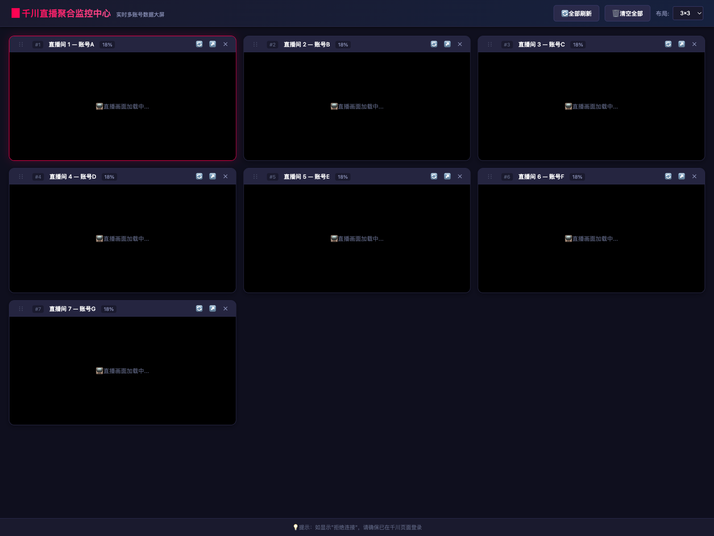
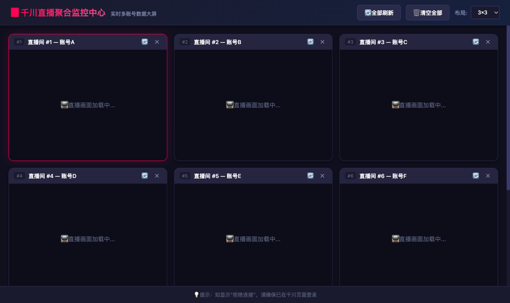
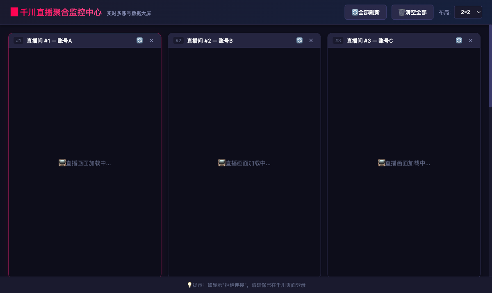
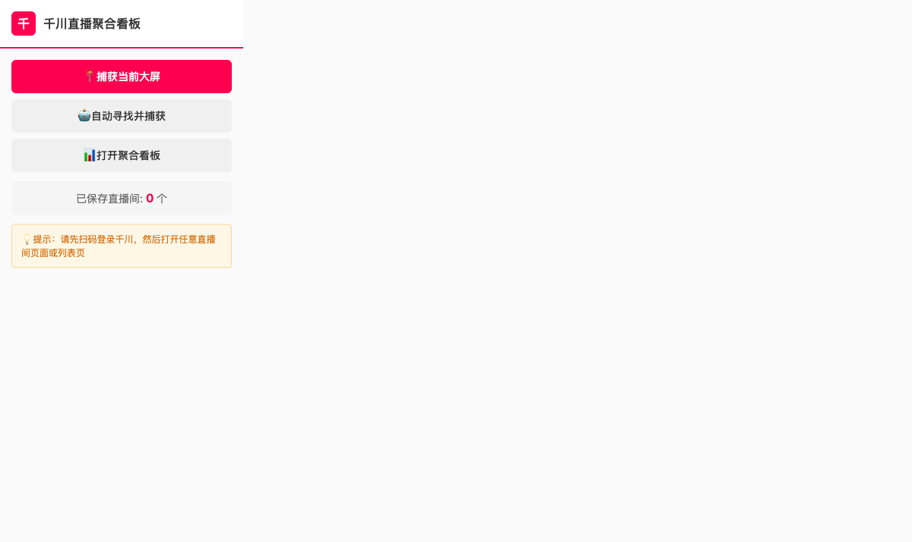

# 千川多账号直播聚合看板

> 一个 Chrome 扩展（Manifest V3），将千川直播平台的多个直播大屏聚合到单一监控中心，并支持实时语音转写。



---

## 功能特性

| 功能 | 说明 |
|------|------|
| 多账号聚合 | 将多个千川直播大屏以 iframe 网格形式集中展示 |
| 多种布局 | 支持 1×1、2×2、3×3、4×4 网格切换，默认 1×1 |
| 自动缩放 | iframe 按容器尺寸自动缩放，完整显示 1920×1080 大屏内容 |
| 拖拽排序 | 卡片支持拖拽调整展示顺序 |
| 自动采集 | 一键遍历 ECP 账号列表，批量保存所有直播大屏链接 |
| 实时语音转写 | 1×1 布局下捕获标签页音频，接入腾讯云 ASR 实时转写 |
| 转写下载 | 一键将转写历史导出为 `.txt` 文件 |

---

## 截图

### 多账号布局



### 3×3 布局预览



### Popup 面板



---

## 安装方法

### 环境要求

- Google Chrome 浏览器（版本 ≥ 116）
- 千川直播平台账号（`qianchuan.jinritemai.com`）

### 安装步骤

1. 点击右上角 **Code → Download ZIP** 下载本项目，解压到本地
2. 打开 Chrome，地址栏输入 `chrome://extensions/`
3. 右上角开启 **开发者模式**
4. 点击 **加载已解压的扩展程序**，选择解压后的文件夹
5. 工具栏出现插件图标即安装成功

---

## 使用指南

### 第一步：添加直播大屏

**方式一：手动捕获**

1. 打开千川页面并登录
2. 进入任意直播间的数据大屏页面
3. 点击浏览器工具栏的插件图标
4. 点击 **捕获当前大屏**

**方式二：自动采集（推荐）**

1. 打开千川 ECP 账号列表页
2. 点击插件图标 → **自动采集全部大屏**
3. 等待采集完成，自动跳转看板

---

### 第二步：查看聚合看板

1. 点击插件图标 → **打开看板**
2. 通过右上角下拉菜单切换布局（1×1 / 2×2 / 3×3 / 4×4）
3. 拖拽卡片 header 可调整顺序
4. 点击 🔄 刷新单个，↗️ 新标签页打开，✕ 删除

---

### 第三步：实时语音转写

> 仅在 **1×1 布局**下可用

#### 配置凭证（首次使用）

1. 点击看板顶部 **⚙️ ASR 设置**
2. 填写以下三项（申请地址见下方）：
   - **AppId**：腾讯云账号 AppId
   - **SecretId**：API 密钥 SecretId
   - **SecretKey**：API 密钥 SecretKey
3. 点击 **保存**

凭证保存在浏览器本地存储中，不会写入代码文件或上传到任何服务器。

> 申请地址：[腾讯云语音识别控制台](https://console.cloud.tencent.com/asr)

#### 开始转写

1. 确认直播间 iframe 有声音播放
2. 点击卡片右上角 **🎤** 按钮
3. 在弹出的共享对话框中：
   - 选择 **当前标签页**
   - 勾选底部 **"分享音频"** ← 必须勾选
   - 点击 **共享**
4. 右侧黑区出现转写面板，灰色为中间结果，白色为最终结果
5. 点击 **⬇ 下载** 可导出全部转写文本为 `.txt`
6. 再次点击 **🎤** 停止转写（历史文字保留，可继续下载）

---

## 所需 Chrome 权限说明

| 权限 | 用途 |
|------|------|
| `storage` | 保存看板列表和 ASR 凭证到本地 |
| `activeTab` | 获取当前标签页信息 |
| `scripting` | 向千川页面注入内容脚本 |
| `tabs` | 管理标签页（自动采集流程） |
| `tabCapture` | 捕获标签页音频（语音转写） |
| `declarativeNetRequest` | 移除 X-Frame-Options 响应头，允许 iframe 加载千川大屏 |
| `host_permissions` | 仅限 `qianchuan.jinritemai.com`、`buyin.jinritemai.com`、`business.oceanengine.com` |

---

## 项目结构

```
├── manifest.json        # 扩展配置，权限声明
├── rules.json           # 移除跨域响应头的网络规则
├── config.js            # ASR 基础配置（不含凭证）
├── background.js        # Service Worker，数据管理与消息路由
├── content.js           # 注入千川页面，自动导航与大屏捕获
├── popup.html/js        # 插件弹出窗口
├── dashboard.html/js    # 聚合看板主页面
└── dashboard.css        # 看板样式
```

---

## 注意事项

- 需要在千川页面**登录**后，iframe 才能正常加载大屏内容；若显示"拒绝连接"，请先登录
- 语音转写必须在共享对话框中勾选 **"分享音频"**，否则无法获取音频
- 腾讯云 ASR 按用量计费，请关注账单和用量告警
- 请勿将 SecretKey 提交到公开代码仓库

---

## License

MIT
